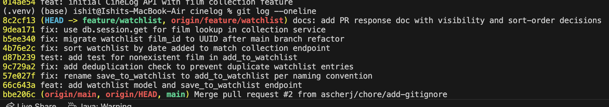

# PR Response Doc — CineLog Watchlist Feature

## AI Usage
I used an AI assistant in three bounded ways, all verified against the actual code:

1. **Orientation.** Before reading the review comments I had the AI summarize `models.py`,
   `services/collection_service.py`, and `tests/test_collection.py` — what each file is responsible
   for, what `add_to_collection()` returns when a film is missing, and the fixture pattern the tests
   use. I confirmed each summary against the source (e.g. that `add_to_collection` raises
   `FilmNotFoundError` *before* touching the session) rather than trusting it blind.

2. **Design stress-testing (Comments 4 & 5).** I wrote my own positions first, then asked the AI to
   argue the reviewer's side — "what counterargument would a careful reviewer raise, what tradeoff am
   I not acknowledging?" For **Comment 4** this surfaced the "unenforced flag becomes a retroactive
   exposure once a browse endpoint ships" risk; I had already leaned on the community-app framing, so
   I *added* the explicit condition that visibility control must land before any cross-user read path,
   rather than changing my position. For **Comment 5** the counter was the queue-vs-recency point; I
   kept my date-added position but wrote out why FIFO/queue ordering is a separate feature, not the
   default. The final wording and the CineLog-specific reasoning (the missing `public` field on
   `CollectionEntry`, the unenforced flag, the existing `get_collection` test) are my own.

3. **History hygiene.** After rewriting commits I had the AI check the messages against the
   Conventional Commits spec and flag any commit bundling more than one logical change — which is how
   I caught that the rebase had folded the `WatchlistEntry` model into the dedup commit, and split it
   back out into the `feat` commit.

## Comment 1 — Rename
**What I did:**
Renamed `save_to_watchlist()` to `add_to_watchlist()` in `services/watchlist_service.py`
so the watchlist service matches the project's `verb_to_noun` convention documented in
`CONTRIBUTING.md` and already followed by the collection service (`add_to_collection`,
`remove_from_collection`, `get_collection`). "save" was the odd one out.

**Where I looked for call sites:**
Ran a project-wide search — `grep -rn "save_to_watchlist" --include="*.py" .` — which surfaced
three references: the definition in `services/watchlist_service.py`, and both the import and
the call site in `routes/watchlist/watchlist.py`. Updated all three.

**How I verified:**
Re-ran the search for `save_to_watchlist` (zero results) and confirmed all `add_to_watchlist`
references resolve. `pytest tests/` → 4 passed at this point (the watchlist test is added later).
(Commit: `fix: rename save_to_watchlist to add_to_watchlist per naming convention`)

## Comment 2 — Deduplication
**What I did:**
Followed the `add_to_collection()` pattern exactly. That function does dedup in two layers, so
I mirrored both:
1. **Service check:** before inserting, `add_to_watchlist()` now queries for an existing
   `WatchlistEntry` with the same `(user_id, film_id)` and raises a new
   `AlreadyInWatchlistError` if one exists — the parallel of `AlreadyInCollectionError`.
2. **Model backstop:** added a `UniqueConstraint("user_id", "film_id",
   name="unique_user_film_watchlist")` to `WatchlistEntry`, mirroring
   `unique_user_film_collection` on `CollectionEntry`. `WatchlistEntry` was missing this, so
   duplicates were possible even below the service layer.
I also surfaced the error in the route (`routes/watchlist/watchlist.py`) as HTTP 409, the same
status `routes/collection.py` returns for `AlreadyInCollectionError`.

**How I verified the logic works:**
Studied `add_to_collection()` first — its check runs `CollectionEntry.query.filter_by(...).first()`
and raises before any `db.session.add`, so a duplicate never reaches the DB and nothing is
committed. Confirmed my version places the check in the same spot (after the film-exists check,
before `db.session.add`), and that the model's `unique_user_film_watchlist` constraint would still
reject a duplicate even if the service check were bypassed. `pytest tests/` → the existing suite
still passes, and I exercised the 409 path manually via curl (add the same film twice → second
request returns 409). (Commit: `fix: add deduplication check to prevent duplicate watchlist entries`)

**Known gap:** `CONTRIBUTING.md` asks for a duplicate/conflict test for a new service function, and
I only added the nonexistent-film test (Comment 3). A dedicated
`test_add_to_watchlist_duplicate_raises` (mirroring `test_add_to_collection_duplicate_raises`) is the
natural next test to add — it's the "second test" candidate under Stretch Features.

## Comment 3 — Missing test
**What I did:**
Created `tests/test_watchlist.py` and wrote `test_add_to_watchlist_nonexistent_film_raises`,
the direct equivalent of `test_add_to_collection_nonexistent_film_raises`.

**Which test I modeled it on:**
Copied the `app` / `sample_user` / `sample_film` fixtures verbatim from `tests/test_collection.py`
and matched its assertion style (`with pytest.raises(FilmNotFoundError)`). One deliberate
difference: the collection test uses a UUID string for the fake ID because collections are already
on UUIDs; the watchlist branch is still pre-refactor (integer `film_id`), so I used a nonexistent
integer `999999`. This line will change during the Comment 6 rebase to UUIDs.

**How I verified:**
`pytest tests/test_watchlist.py -v` → 1 passed. Full suite `pytest tests/ -v` → 5 passed.
(Commit: `test: add test for nonexistent film in add_to_watchlist`)

## Comment 4 — Default visibility
**My position:**
Keep `public=True` as the default for `WatchlistEntry`.

**Reasoning (grounded in CineLog):**
- CineLog describes itself as *"a community film tracking app."* Its entire value proposition
  is social — logging, rating, and building collections that other people can see and draw
  recommendations from. A default that hides watchlists works against the product's stated purpose.
- The precedent is already set by `CollectionEntry`: it has **no privacy field at all**. The app
  currently treats a user's *watched history and ratings* — the more opinionated, judgment-bearing
  data — as community-visible by design. A watchlist (an intent to watch) is lighter-weight than a
  rated collection entry, so defaulting the watchlist to public is *consistent* with the app's
  existing data-sharing posture, not a new escalation of it.
- The community discovery signal only exists if watchlists are populated. "What are people planning
  to watch" is a core signal for a film app; a private-by-default watchlist would leave that feature
  empty at launch because most users never touch a visibility setting. Defaulting private would
  effectively ship the social feature dead-on-arrival.
- The default is a safe forward-looking choice specifically because `public` is **currently
  unenforced** — `view_watchlist` returns all of a user's own entries regardless of the flag, and no
  endpoint yet exposes one user's watchlist to another. That means there is still a window to add
  explicit visibility control (the `public` request parameter / an onboarding prompt) *before* any
  read path actually exposes the flag, so no user is exposed retroactively. The schema field itself
  is the opt-out escape hatch.

**Tradeoff acknowledged:**
A watchlist encodes *intent and future behavior*, which some users find more revealing than history
("I still haven't seen these classics," "I'm planning to watch X"). Public-by-default means a user
who never considers the setting is exposed by omission, and privacy defaults are notoriously hard to
walk back once a "browse public watchlists" endpoint ships. I accept that risk on two conditions
that CineLog's current state makes cheap: (1) because nothing reads `public` yet, we commit to
landing explicit visibility control *before* the first cross-user read path, and (2) if usage shows
users are uncomfortable, flipping the default to `False` is a one-line change — whereas the community
feature cannot bootstrap without a permissive default now. In short: the reviewer's privacy concern
is real but presently *theoretical* (no enforcement exists), the mitigating control already lives in
the schema, and the community-first purpose makes permissive-by-default the right tone to set.

## Comment 5 — Sort order
**My position:**
Implemented the maintainer's preference — `get_watchlist()` now sorts by
`WatchlistEntry.date_added.desc()` (newest first), replacing the alphabetical `Film.title.asc()`.
(Commit: `fix: sort watchlist by date added to match collection endpoint`.)

**Engagement with the reviewer's point:**
The reviewer's core argument is *consistency*: `get_collection()` already sorts `date_added.desc()`
and even has a test locking that behavior in (`test_get_collection_returns_newest_first`). Having two
list endpoints in the same app return results in two different orders is a real inconsistency — it
surprises API consumers and forces any shared "list of films" UI/client logic to special-case the
watchlist. I agree this is the decisive factor: the alphabetical sort reads like an unconsidered
default rather than a deliberate design choice, and there's no CineLog-specific reason the watchlist
should behave differently from the collection.

I did consider two counter-positions and reject them:
- **Alphabetical (keep as-is):** aids findability in a long list, but a watchlist is short and
  intent-driven, not a reference index — you scan it to decide what to watch next, not to look up a
  known title. Findability doesn't outweigh app-wide consistency here.
- **Oldest-first (FIFO queue):** defensible if we framed the watchlist as a strict queue, but that's
  a stronger product claim than the feature currently makes, and it would *also* break parity with
  the collection. If deliberate queue ordering is ever needed, that's a dedicated feature (manual
  reordering / "watch next" position), not the default sort.

**Tradeoff acknowledged:**
`date_added.desc()` surfaces freshly-added films and pushes long-standing "someday" entries to the
bottom — arguably the opposite of what a to-watch queue wants. I accept that because it matches the
established collection behavior and user mental model ("most recent activity first"), and because a
true prioritized queue is out of scope for this PR.

Side effect of the change: I dropped the now-unnecessary `.join(Film)` (it existed only to sort by
`Film.title`), so `get_watchlist()` now mirrors `get_collection()`'s query shape exactly.

## Comment 6 — Rebase
**Setup:**
`git fetch origin` then `git rebase origin/main`. The merge base was the initial commit
(`014ae54`); main had since gained `refactor: migrate film IDs from integer to UUID` (which changed
`Film.id` and `CollectionEntry.film_id` from `db.Integer` to `db.String(36)`) and a `chore: add
.gitignore`. My branch replayed its six watchlist commits on top of that.

**What conflicted:**
- **`models.py`** — the real conflict. My branch defined `WatchlistEntry.film_id` as `db.Integer`
  with a `db.ForeignKey("film.id")`, while main had migrated the referenced `film.id` (and
  `CollectionEntry.film_id`) to UUID `String(36)`. An integer FK pointing at a UUID PK is broken, so
  git flagged the `WatchlistEntry` block.
- **`.gitignore`** — main added its own committed `.gitignore`. I had only an *untracked* local one,
  so before rebasing I deleted mine (main's is a superset — it also ignores `.pytest_cache/`) to
  avoid an "untracked file would be overwritten" checkout error. No content conflict resulted.

**How I resolved it:**
1. In `models.py`, changed `WatchlistEntry.film_id` from `db.Integer` to
   `db.String(36)` so it matches the new UUID `film.id` primary key (and mirrors the already-migrated
   `CollectionEntry.film_id`). Kept my `unique_user_film_watchlist` constraint. Marked resolved with
   `git add models.py` and `git rebase --continue`.
2. Then I swept the rest of the watchlist code for now-stale integer assumptions and updated them to
   UUIDs:
   - `services/watchlist_service.py` docstring `film_id (int) … pre-refactor` → `film_id (str): UUID`.
   - `routes/watchlist/watchlist.py` request-body doc `{ "film_id": <int> }` → `{ "film_id": "<uuid>" }`.
   - `tests/test_watchlist.py` fake ID `999999` → `"00000000-0000-0000-0000-000000000000"`, matching
     the UUID string that `test_collection.py` already uses for its nonexistent-film test.

   During the rebase these two steps landed as two separate commits (the conflict resolution, then a
   reference-sweep follow-up). In the Milestone 4 history cleanup I consolidated them into a single
   logical commit — **`fix: migrate watchlist film_id to UUID after main branch refactor`** — since
   they're one change: making the watchlist speak UUIDs. That single commit is what appears in the
   final history below.

**How I verified no conflict remains:**
- `grep -rn "<<<<<<<|=======|>>>>>>>"` across `models.py`, `services/`, `routes/`, `tests/` → none.
- `grep` for lingering integer film_id references (`<int>`, `999999`, `film_id.*int`) → none in code.
- `python -c "import ast; ast.parse(...)"` on `models.py` → parses clean.
- `pytest tests/` → 5 passed.
- `git log --oneline --merges origin/main..HEAD` → **empty** (no merge commits); the branch is a
  linear replay on top of `origin/main`.

## Commit history (Milestone 4)



---

## PR Description

### What this feature does
Adds a **watchlist** to CineLog: a per-user list of films a user wants to watch (distinct from the
collection, which is films they've already watched). The feature adds a `WatchlistEntry` model, a
`watchlist_service` with `add_to_watchlist()` / `get_watchlist()`, and REST endpoints under
`/watchlist`. Adding a film that's already on the list is rejected (deduplicated); the list is
returned newest-first.

### Endpoints
| Method | Endpoint | Description |
|--------|----------|-------------|
| GET | `/watchlist/<user_id>` | Return the user's watchlist, newest-added first |
| POST | `/watchlist/<user_id>/add` | Add a film. Body: `{ "film_id": "<uuid>" }` |

Responses: `201` on add, `400` if `film_id` missing, `404` if the film doesn't exist, `409` if it's
already on the watchlist.

### Design decisions
1. **Default visibility = public (`public=True`).** Optimizes for CineLog's stated community-discovery
   purpose and stays consistent with `CollectionEntry`, which has no privacy field at all. The flag is
   currently unenforced, so the standing commitment is to add explicit visibility control before any
   endpoint exposes one user's watchlist to another. (Full argument: Comment 4 above.)
2. **Sort order = date added, newest first.** Adopted the maintainer's preference for consistency with
   `get_collection()` (which is date-added-desc and has a test locking that in), rather than the
   original alphabetical sort. (Full argument: Comment 5 above.)

### How to manually test
The app has no create-user/create-film endpoints (films and users are seeded), so seed one of each,
then exercise the endpoints:

```bash
# 1. Start the app (uses sqlite:///cinelog.db in the current directory)
python app.py

# 2. In a second terminal (same directory), seed a user and a film and print their UUIDs
python -c "
from app import create_app, db
from models import User, Film
app = create_app()
with app.app_context():
    u = User(username='alice', email='alice@example.com')
    f = Film(title='Dune', year=2021, genre='Sci-Fi')
    db.session.add_all([u, f]); db.session.commit()
    print('USER_ID =', u.id)
    print('FILM_ID =', f.id)
"

# 3. Add the film to the watchlist  ->  expect 201 and the new entry
curl -i -X POST http://127.0.0.1:5000/watchlist/<USER_ID>/add \
  -H "Content-Type: application/json" -d '{"film_id": "<FILM_ID>"}'

# 4. View the watchlist  ->  expect a JSON list containing the film
curl -s http://127.0.0.1:5000/watchlist/<USER_ID>

# 5. Add the SAME film again  ->  expect 409 (already on watchlist)
curl -i -X POST http://127.0.0.1:5000/watchlist/<USER_ID>/add \
  -H "Content-Type: application/json" -d '{"film_id": "<FILM_ID>"}'

# 6. Add a nonexistent film  ->  expect 404
curl -i -X POST http://127.0.0.1:5000/watchlist/<USER_ID>/add \
  -H "Content-Type: application/json" \
  -d '{"film_id": "00000000-0000-0000-0000-000000000000"}'
```

Automated coverage: `pytest tests/` (5 passing, including
`test_add_to_watchlist_nonexistent_film_raises`).
